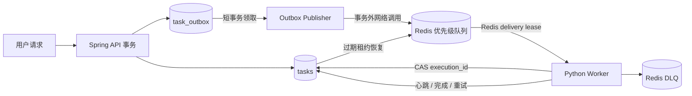

# ADR-002：Redis 投递与 PostgreSQL 执行租约

- 状态：Accepted
- 日期：2026-09-03
- 适用范围：Spring Boot API、Python Worker、Supabase PostgreSQL、Upstash Redis

## 背景

NoteFlow 的 PDF 解析、向量化、AI 笔记、问答、闪卡和测验都是长任务。仅用 Redis list 会留下三个生产级缺口：消费者取走消息后崩溃会丢任务；重复投递可能重复扣费或覆盖新结果；Redis 暂时不可用时，数据库事务和网络调用可能彼此阻塞。

## 决策

PostgreSQL 是任务状态和执行所有权的唯一事实源，Redis 是低延迟、至少一次的投递层。两者通过 transactional outbox 连接。

核心约束如下：

1. API 在一个数据库事务内创建 `tasks` 与 `task_outbox`；业务事务不直接依赖 Redis。
2. Publisher 用 `claim_token` 和 `FOR UPDATE SKIP LOCKED` 在短事务中领取 outbox，提交事务后才访问 Redis，再用另一个短事务结算结果。
3. outbox 超过重试上限写入 `dead_letter_at`，仍处于 `PENDING/RETRYING` 的任务同步转为 `FAILED`，避免 UI 永远转圈。
4. Worker 从 Redis 取消息时建立 Redis delivery lease，但只有以 `execution_id` 原子领取到 PostgreSQL 任务后才可执行。
5. 进度、完成和失败写入都带 `execution_id` compare-and-set 条件；旧 worker 即使晚到，也不能覆盖新执行者的状态。
6. 正常业务失败已由 pipeline 写成 `FAILED`，消费者确认消息，不做无意义重试。只有逃逸异常进入有界重试，超过预算进入带原因与时间戳的 DLQ。
7. Redis 消息丢失或 Redis 暂时不可用不会永久卡住任务：恢复扫描会重新发布数据库中的 `RETRYING` 行。重复消息由数据库领取操作廉价拒绝。
8. SIGTERM/SIGINT 触发有界 drain；线程池和进程池不会再因 context manager 的隐式无限等待而阻止容器退出。

## 并发模型

- I/O 型 AI、数据库和 HTTP 工作使用有界 `ThreadPoolExecutor`。
- CPU 型 PDF 解析使用 `spawn` 的 `ProcessPoolExecutor`，避免 GIL 争用和继承父进程数据库 socket。
- 主 worker 默认最多 4 个数据库连接；每个解析子进程最多 1 个。Cloud Run 必须限制实例数，不能只看单实例连接池。
- 交互任务、用户可见任务和后台任务使用加权优先级，同时为后台任务保留容量，避免饥饿。
- worker 到 API 的调用携带共享服务凭据和当前 workspace；用户 JWT 不会被伪造或跨租户复用。

## 不变量

- 同一 `task_id` 同一时刻最多一个有效 `execution_id`。
- 没有当前执行租约的 worker 不得更新任务终态或文档终态。
- Redis ACK 只发生在数据库已经终结、已安排可靠重试，或确认当前消息已过时之后。
- Redis DLQ 条目必须保存 `failedAt`、`reason` 和原始 payload。
- 网络 I/O 不得在持有 outbox 行锁的数据库事务中执行。

## 代价与后续

该设计选择“至少一次投递 + 数据库幂等执行”，不承诺端到端 exactly-once；外部 AI 调用仍可能在响应返回前发生网络中断，因此生成物写入也必须保持幂等键或版本约束。后续需要增加 DLQ 管理端点、队列/租约指标告警，以及正式的 Cloud Run 唤醒器。

## 未采用方案

- 仅 Redis list：崩溃窗口和重复执行不可接受。
- 仅轮询 PostgreSQL：实现简单，但持续数据库查询不适合免费配额，也弱化 Redis 的工程展示价值。
- 把 Redis 调用放进业务事务：网络抖动会延长行锁，并不能获得跨系统原子性。
- 无限重试：会形成毒任务循环和不可控 AI 成本。
