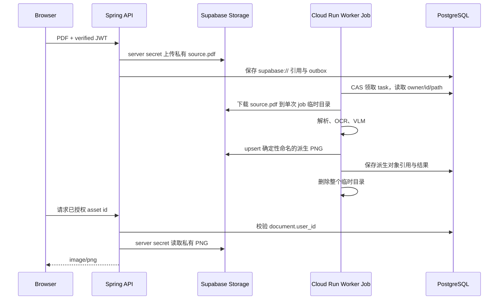

# ADR-003：私有对象存储与临时文件边界

- 状态：Accepted
- 日期：2026-09-03
- 适用范围：Spring Boot API、Python Worker、Supabase Storage

## 背景

本地版本把 PDF、整页渲染图和视觉区域图写入同一台机器的 `storage/`。Cloud Run API 与 Worker Job 没有共享磁盘，实例文件系统也不是持久卷；继续把绝对本地路径写入 PostgreSQL 会导致 Worker 无法读取 API 上传的 PDF，API 也无法返回 Worker 生成的 PNG。

## 决策

默认 profile 保留本地文件系统以支持低成本开发；`cloud` profile 使用 Supabase 的私有 `noteflow-private` bucket。数据库中的云端路径是不可公开访问的逻辑引用：

```text
supabase://noteflow-private/users/<user-id>/documents/<document-id>/source.pdf
supabase://noteflow-private/users/<user-id>/documents/<document-id>/rendered/page-001.png
supabase://noteflow-private/users/<user-id>/documents/<document-id>/regions/page-001-region-00.png
```

上传、处理和读取链路如下：



Supabase 当前推荐受控服务器使用 `sb_secret_...` key，并通过 `apikey` header 发送；仓库仅为迁移兼容旧 `service_role` JWT。两种凭据都只存在于 API/Worker 的 secret 环境变量中。官方说明 secret/service keys 绕过 RLS，绝不能进入浏览器：[API keys](https://supabase.com/docs/guides/getting-started/api-keys)、[Storage access control](https://supabase.com/docs/guides/storage/security/access-control)。

## 不变量

- bucket 始终为 private，浏览器不持有 Storage 管理凭据。
- API 返回图片前必须通过数据库对象关系校验当前用户拥有 document；客户端不能提交任意对象路径。
- Worker 只接受与数据库 `user_id`、`document_id` 精确匹配的 source object path。
- 派生对象名称由 document/category/filename 决定；任务重试使用 upsert，不产生随机重复副本。
- 云端 PDF 只在单次 Worker Job 的临时目录存在，退出时整个目录清除。
- 下载和读取均有大小上限；对象扩展名与 PNG magic bytes 必须同时匹配。
- 新 `sb_secret_...` key 不放进 `Authorization: Bearer`；旧 JWT 才使用兼容 bearer header。

## 失败语义

- PDF 已上传而数据库事务回滚：事务完成回调删除 source object。
- Worker 下载失败：任务失败并保留可诊断错误；源对象仍在，可显式重试。
- 派生对象上传后数据库写入失败：确定性路径允许下一次执行覆盖；后续应增加孤儿对象清理任务。
- API 图片代理读取失败：返回受控服务错误，不泄露 secret、对象响应体或内部路径。

## 代价与后续

图片经 API 代理会消耗 API 内存和带宽，但保持了单一授权边界，适合第一阶段。达到明显流量后，可由 API 生成极短期 signed URL，并继续先做 tenant 校验。还需要真实 Supabase 项目验证 bucket、50 MB 限制、secret key 轮换和对象生命周期清理。

## 未采用方案

- Cloud Run 本地磁盘共享：实例间不共享且生命周期短，不满足持久化。
- public bucket：PDF 与学习材料可能包含隐私内容，不能以不可猜路径代替访问控制。
- 浏览器直接用 secret/service-role key：会让任何用户绕过 RLS，完全不可接受。
- 把整个 PDF 存进 PostgreSQL bytea：增加数据库备份、连接与 IO 压力，也浪费 Supabase 独立 Storage 配额。
