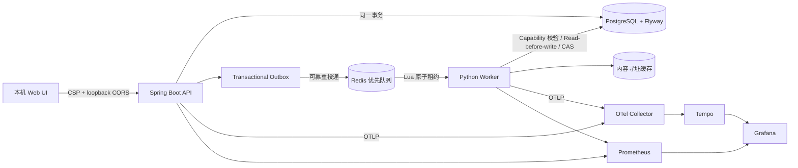

# NoteFlow 安全、可靠性与性能整改实施说明

日期：2026-07-31

适用范围：本机、单用户、仅回环地址运行
明确排除：API Key 的存储方式（按用户要求，本轮未调整）

## 1. 文档目的

本文汇总本次及此前对话中已经落地的整改，说明原问题、实现方式、关键边界和验证结果。它与
`PROJECT_AUDIT_2026-07-30.md` 的关系是：审计文档描述“发现了什么”，本文描述“实际改了什么”。

## 2. 整改后的关键架构

## 3. Agent 写操作与 Prompt Injection

### 原问题

- 模型可以自行输出 `confirm: true`，不能把模型生成的确认字段当成人类授权。
- 编辑、删除、保存等工具没有统一写 capability。
- 恶意 PDF 的文字可能伪装成指令，诱导 Agent 修改本机数据。
- 编辑没有强制版本条件，可能覆盖并发修改。

### 已实施

- 写能力由服务端根据本轮 UI 开关和用户原始意图签发，模型输出不能创造 capability。
- 持久化工具按 retrieval、learning、workspace、analytics、planning、validation 分类；写工具统一检查
  server-issued capability。
- 删除动作除 capability 外还要求用户原始输入中存在明确删除意图；模型生成的 `confirm` 不能单独通过。
- workspace 修改采用 read-before-write：同一次 Agent run 必须先读取目标 Markdown。
- Note 修改带 `expectedUpdatedAt`/内容哈希条件，版本不一致返回并发编辑错误，不再静默覆盖。
- Prompt 明确把 PDF、检索证据、历史消息视为不可信数据；工具策略和系统规则位于其外层。
- 旧 observation 只保留摘要、SHA-256 与持久化 handle，最近步骤才带完整内容，降低间接注入被反复带入后续
  planning prompt 的机会。

边界说明：本地单用户模式不等于“文档可信”。恶意 PDF 仍按不可信输入处理，但 API 本身只绑定回环地址。

## 4. DB → Redis 可靠任务投递

### 原问题

数据库任务已提交而 Redis 入队失败时，`PENDING` 任务可能永久滞留。

### 已实施

- 新增 `task_outbox`，任务与 outbox event 在同一数据库事务内提交。
- 独立 publisher 使用批量锁定、重试次数、下次重试时间和错误记录发布 Redis。
- Redis 暂时不可用时不会丢任务；事件保留到成功发布，并有定期清理策略。
- 增加 Redis 失败单元测试，确认失败会记录、延迟重试，不会错误标记已发布。

## 5. Redis 租约并发

- pop 时原子写入 processing payload 与 deadline。
- ack、renew、过期读取/删除/重新入队改为 Lua 原子操作。
- lease 带唯一 ID；续租不会为已不存在的 lease 制造孤儿 deadline。
- 优先队列为交互、用户可见、后台任务保留容量，并保留后台任务的公平调度。
- 测试覆盖 ack、过期回收、缺失 lease 续租、旧 payload 迁移和优先级饥饿。

## 6. 数据一致性与并发

- Quiz/Flashcard 的版本分配在事务中使用 PostgreSQL advisory lock，消除
  `MAX(version)+1` 的并发竞争。
- Flashcard review 使用按用户和卡片的事务锁，并用外部 event ID 保证幂等。
- Quiz 批量答案最多 500 条，先校验题目归属和重复 ID，再用 batch upsert 一次提交。
- 学习记忆写入、重算和并发答题共享一致的 topic lock 与幂等事件键。
- `DataAccessException` 不再伪装成 `NOT_STARTED`；只有真实“无记录”才映射该状态。
- PDF 上传在数据库事务回滚时注册文件补偿删除，且删除路径必须位于受管 upload 目录。

## 7. 数据库迁移统一

### 已实施

- Hibernate 改为 `ddl-auto: validate`。
- Flyway V1 是完整基线，V2 创建可靠 outbox，V3 创建内容寻址缓存和 VLM fingerprint 索引。
- 删除 Java 的 Conversation、LearningMemory、Performance、LocalPersistence 运行时 schema manager。
- 删除 Worker 中的 `CREATE TABLE`、`ALTER TABLE`、`DROP CONSTRAINT` 和 `CREATE EXTENSION`。
- Worker 的 `ensure_*_schema` 现在只校验必需表；未迁移时明确提示先运行 Flyway。
- 动态 HNSW 索引仍保留在 Retrieval 运维组件中：它是按 embedding 维度生成的派生索引，不是基础表结构。
- 新增治理测试，禁止运行时代码重新引入应用 DDL。

## 8. 依赖与供应链

- Gradle Wrapper 固定到 9.6.0，并启用 dependency locking。
- Spring Boot 升至 3.5.16；Gradle 弃用警告作为失败处理。
- Python 使用 `pyproject.toml` 和 `uv.lock`，锁文件包含制品 SHA-256。
- LangGraph 1.2.10、checkpoint 4.1.1、Pillow 12.3.0、pypdf 6.14.2 已锁定。
- OpenTelemetry、Prometheus Client 和 Playwright 也已进入锁文件。
- CI 执行 `pip-audit`、Trivy 高危/严重扫描、CycloneDX SBOM 和 Dependabot。
- Playwright 从存在高危审计结果的旧版本升至 1.62.1；`npm audit --audit-level=high` 通过。

## 9. 性能优化

### API 与前端

- Documents/Notes 列表增加 opaque cursor pagination，限制每页大小并裁剪响应。
- 大 Markdown 支持 offset/length Range 式读取，避免一次加载全部正文。
- 长列表使用 `content-visibility` 降低非可视区域布局成本。
- 任务状态使用 SSE 推送；轮询只作为断流后的低频兜底。
- Quiz 答案支持批量提交。
- 富文本/XSS 渲染器从 `app.js` 拆到独立 ES module；主脚本启用 module 加载。

### Worker 与模型

- Notes、Embedding 等 provider 使用进程级 semaphore，避免不同 pipeline 实例绕过并发上限。
- Agent 旧 observation 变成增量摘要与 handle，限制 prompt 随步骤线性膨胀。
- 模型 usage 从 provider 实际响应读取，输入/输出 token 和可配置价格用于真实费用核算。
- VLM 成功结果逐区域提交，失败重启只补缺失区域。
- 新 embedding 维度自动创建并巡检 HNSW 索引。

### 内容寻址缓存

`content_addressed_cache` 的主键为 `(namespace, content_hash, producer_version)`，缓存记录命中次数和最后访问时间。

- PDF 原生文本解析：按 PDF bytes SHA-256 + document type + parser version 复用。
- OCR：按渲染页图片 SHA-256 + OCR backend/language/version 复用。
- VLM：按裁剪图片、region type、bbox 和 prompt version 的 fingerprint 复用。
- Markdown：按规范化 layout/VLM 输入、文档类型和 renderer version 复用。
- producer/prompt 版本参与键计算，算法升级时自动旁路旧缓存。

## 10. 可维护性

- Worker 大型 Repository 已拆出 `db/models.py`、`db/connection.py`、`db/schema.py` 和
  `cache/content_addressed.py`；主 Repository 只保留业务查询与写入。
- Java `StudyService` 改为兼容 facade，Flashcard 与 Quiz 分别由
  `FlashcardStudyService`、`QuizStudyService` 实现。
- 前端安全富文本渲染拆为 `rich-renderer.js`。
- Java `System.out`、Python `print` 迁移为结构化 logging；请求和任务包含 trace/event 标识。

## 11. 观测能力

- API 暴露 health、Prometheus metrics，使用 Micrometer OpenTelemetry bridge。
- Worker 暴露 Prometheus process metrics，并对 task 建 span；Psycopg/Redis 自动 instrumentation。
- `docker compose --profile observability up` 可启动 OTel Collector、Tempo、Prometheus 与 Grafana；API 启动时设置
  `NOTEFLOW_OTLP_ENABLED=true`，Worker 设置 `OTEL_EXPORTER_OTLP_ENDPOINT=http://127.0.0.1:4318/v1/traces`。
- 所有观测服务只映射到 `127.0.0.1`。
- Grafana 自动配置 Prometheus/Tempo datasource 和 NoteFlow Overview dashboard。

## 12. PDF 沙箱与安全测试

- CPU 密集 PDF 处理使用 `spawn` 的独立进程池，不继承父进程 DB/Redis socket。
- parser child 设置 `RLIMIT_CORE=0`、打开文件数、输出文件大小上限和 `umask 077`。
- 上传检查扩展名、PDF signature、请求大小；路径删除限制在受管目录。
- 恶意/畸形 PDF 测试覆盖截断 stream、异常 length、JavaScript 标记和随机二进制，要求失败关闭且不得产生旁路文件。
- Playwright 浏览器测试向富文本渲染器注入 `<script>`、`onerror` 等 payload，验证不会生成可执行节点。

注意：这是资源隔离，不是虚拟机级隔离。对“本机单用户”威胁模型足够保守；若未来改成多人或公网服务，应把
PDF 转换器迁移到无网络、只读根文件系统、seccomp/AppArmor 的独立容器。

## 13. 已执行验证

- API 单元测试：`./gradlew test --warning-mode fail` 通过。
- API PostgreSQL 集成测试：`NOTEFLOW_RUN_DB_TESTS=1 ./gradlew test --rerun-tasks --warning-mode fail` 通过。
- Worker 单元 + PostgreSQL/Redis 集成测试：142 项通过。
- Python compileall：通过。
- Node `--check`：`app.js` 与 `rich-renderer.js` 通过。
- Playwright Chromium XSS E2E：1 项通过。
- `pip-audit`：No known vulnerabilities found。
- Flyway：V3 已由 Flyway 正式应用，本机 schema 当前为 v3。

## 14. 明确未处理项

只有用户明确排除的 API Key 存储方式未改动。Key 仍可从本机环境变量/现有设置路径读取；本文不把这一项标记为
已修复。若未来从本机单用户升级为多人或联网部署，应优先迁移到 OS Keychain/Secret Service 或独立 secrets
manager，并增加密钥轮换和最小权限。

## 15. 继续扩展 AI Agent 的建议

1. 可验证计划执行：为复杂学习目标生成 DAG，每个节点带前置条件、产物 schema、预算和验收器。
2. 多模态课程知识图谱：把公式、图、代码、概念、错题和引用页建成可追溯图，Agent 用图检索与向量检索联合规划。
3. 反事实学习教练：根据 mastery history 自动选择“解释、例题、检索练习、间隔复习”，并用实验分组评估策略。
4. Artifact provenance：每份 Note/Quiz/Flashcard 保存模型、Prompt、输入 chunk hash、评估分和重生成谱系。
5. 本地 Agent policy simulator：在真正写入前预演 capability、预计 diff、费用和影响范围，支持一次性批准计划。
6. 离线评测平台：固定一组课程 PDF 与恶意文档，持续测引用正确率、公式保真、Prompt Injection 成功率、成本和延迟。
